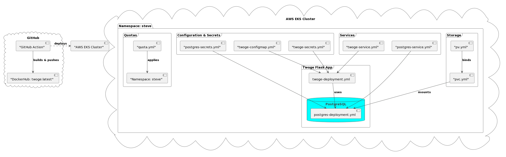

# Twoge Flask App Deployment on Kubernetes

This project details the deployment process of a Flask application named Twoge onto an AWS EKS cluster using Kubernetes. It includes continuous integration and delivery (CI/CD) through GitHub Actions, orchestrating the build and deployment process automatically upon code pushes to the repository.

## Table of Contents

- [Twoge Flask App Deployment on Kubernetes](#twoge-flask-app-deployment-on-kubernetes)
	- [Table of Contents](#table-of-contents)
	- [Prerequisites](#prerequisites)
 	- [Architecture Diagram](#architecture-diagram)
	- [Installation](#installation)
	- [Configuration](#configuration)
	- [Deployment](#deployment)
	- [CI/CD with GitHub Actions](#cicd-with-github-actions)
	- [Monitoring and Management](#monitoring-and-management)

## Prerequisites

Before you begin, ensure you have the following installed:

- Docker
- Kubernetes
- kubectl
- AWS CLI (configured for EKS)
- Minikube (for local testing)
- GitHub account (for CI/CD)

## Architecture Diagram

Below is the architecture diagram for the Twoge Flask application deployment using Kubernetes on AWS EKS, illustrating how components interact within the cloud environment.



## Installation

1. **Clone the Repository**

   ```sh
   git clone https://github.com/stephanlamoureux/twoge-kubernetes.git
   ```

2. **Build the Docker Image**

   Navigate to the cloned repository and build the Docker image:

   ```sh
   docker build -t twoge .
   ```

3. **Run Docker Compose**

   Start the services defined in `docker-compose.yml`:

   ```sh
   docker-compose up -d
   ```

## Configuration

- **Environment Variables**

  Create a `.env` file based on the provided example to configure the database credentials:

  ```sh
  DB_USER=twoge
  DB_PASSWORD=twoge
  DB_NAME=twoge
  DB_PORT=5432
  DB_HOST=twoge-db
  DB_TYPE=postgresql
  ```

- **Kubernetes Namespace**

  Apply the namespace configuration:

  ```sh
  kubectl apply -f namespace.yml
  ```

- **Resource Quota**

  Set resource limits for the namespace:

  ```sh
  kubectl apply -f quota.yml
  ```

## Deployment

1. **Persistent Volume and Claim**

   Apply the PV and PVC to manage storage:

   ```sh
   kubectl apply -f pv.yml
   kubectl apply -f pvc.yml
   ```

2. **Deploy PostgreSQL**

   Deploy the PostgreSQL database with secrets and services:

   ```sh
   kubectl apply -f postgres-deployment.yml
   kubectl apply -f postgres-secrets.yml
   kubectl apply -f postgres-service.yml
   ```

3. **Deploy Twoge Application**

   Deploy the Twoge Flask application:

   ```sh
   kubectl apply -f twoge-deployment.yml
   kubectl apply -f twoge-service.yml
   ```

4. **Apply ConfigMap**

   Apply the configuration for the application:

   ```sh
   kubectl apply -f twoge-configmap.yml
   ```

## CI/CD with GitHub Actions

The project uses GitHub Actions for continuous integration and continuous deployment (CI/CD), automating the process of building the Docker image and deploying it to the AWS EKS cluster.

- **EKS-CICD.yml Workflow**

  The workflow defined in `EKS-CICD.yml` triggers on pushes to the `eks` branch. It performs the following steps:

  1. **CI Job:**
     - Checks out the repo.
     - Sets up Docker buildx.
     - Logs in to DockerHub.
     - Builds and pushes the Docker image to DockerHub.

  2. **CD Job:**
     - Checks out the repo.
     - Configures AWS credentials.
     - Updates kubeconfig for EKS.
     - Deploys the application to EKS using `kubectl apply`.

- **Secrets and Environment Variables**

  The workflow utilizes secrets for Docker and AWS credentials, ensuring secure access to external services without hardcoding sensitive information in the repository.

## Monitoring and Management

- **Launch a Local Server**

  For local testing with Minikube:

  ```sh
  minikube service twoge-service --url -n steve
  ```

- **View Logs**

  Check the logs for a specific pod:

  ```sh
  kubectl logs <pod-name> -n steve
  ```

- **Delete Pods**

  Remove specific pods:

  ```sh
  kubectl delete pods <pod-name> -n steve
  ```

- **Cleanup**

  Delete all resources in the namespace:

  ```sh
  kubectl delete --all -f . -n steve
  ```

- **Node Information**

  Get detailed information about the nodes:

  ```sh
  kubectl describe nodes
  ```
